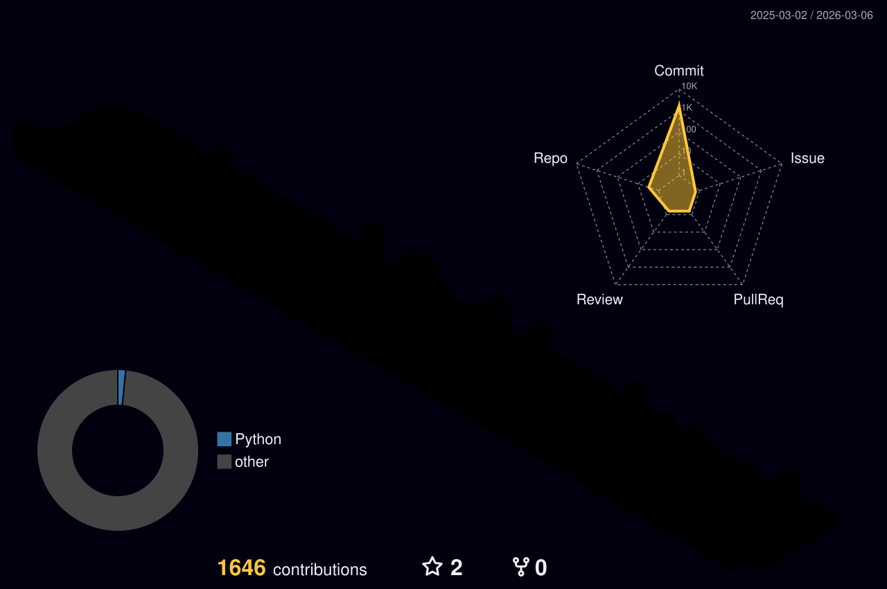

# 💫 About Me:
’m a Python developer with a deep focus on building in the AI/ML space. I’m less interested in just reading papers and more interested in actually shipping models that solve problems—whether that’s through computer vision, predictive analytics, or NLP. My GitHub is a reflection of my curiosity and my commitment to clean, scalable code. I’m currently focused on expanding my portfolio with end-to-end ML projects and am always open to discussing technical challenges or new professional directions where I can contribute to high-impact builds.

## 🌐 Socials:
   

# 💻 Tech Stack:
                                  

  

---
